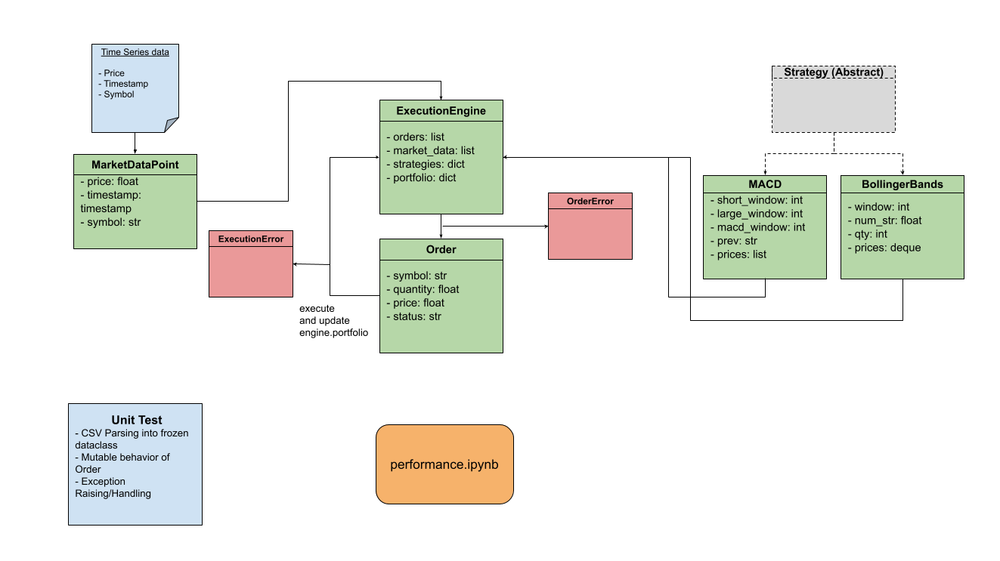

# Group20 Backtester

A small, educational backtesting framework developed for FINM325 — designed to run trading strategies over historical price data and produce performance reports.

## Overview

This repository implements a simple backtester. Current repo files of interest:

- `src/data_loader.py` — loads historical market data (CSV) and converts rows into `MarketDataPoint` objects.
- `src/models.py` — domain models: `MarketDataPoint`, `Order`, `OrderStatus`, `OrderAction` and custom Exceptions.
- `src/strategies.py` — strategy implementations (e.g., macd). Strategies expose `generate_signals` or a similar method.
- `src/engine.py` — execution engine that applies strategy signals to the portfolio and simulates fills.
- `src/reporting.py` — reporting utilities to compute returns, drawdowns and plot equity curves.
- `src/main.py` — entrypoint script that wires all components together and runs experiments.

## Requirements

- Python 3.10+ recommended
- Create and activate a virtual environment before installing dependencies.

Example (macOS / zsh):

```bash
python3 -m venv .venv
source .venv/bin/activate
pip install -r requirements.txt
```

If you don't have a `requirements.txt`, install commonly used packages:

```bash
pip install pandas numpy matplotlib
```

## Project structure

- `src/` — source code
- `data/` — (suggested) place CSV historical price files here
- `notebooks/` — (suggested) Jupyter notebooks for analysis
- `README.md` — this file

## Data format

The backtester expects historical data in a timeseries CSV with at least the following columns:

- `timestamp` — ISO-8601 datetime string (e.g. `2020-01-01T09:30:00`)
- `symbol` — ticker symbol (e.g. `AAPL`)
- `price` — float price (close or mid-price depending on your source)

Example CSV:

```csv
timestamp,symbol,price
2020-01-02T09:30:00,AAPL,300.35
2020-01-02T09:31:00,AAPL,301.00
```

If you have OHLCV data, modify `src/data_loader.py` to parse and yield the fields your strategies need.

## How to run a backtest

1. Prepare data in `data/your_symbol.csv`.
2. Implement or pick a strategy in `src/strategies.py`.
3. Use `src/main.py` to run the backtest. A typical `main.py` does:
   - load data
   - create strategy instance
   - create engine with starting capital
   - run engine over data
   - produce a report

A minimal example (conceptual):

```python
from src.data_loader import load_data
from src.strategies import MovingAverageCrossoverStrategy
from src.engine import ExecutionEngine
from src.reporting import Reporter

data = load_data()  # loads `data/market_data.csv` by default
strategy = MovingAverageCrossoverStrategy()
engine = ExecutionEngine(data)
engine.run()

report = Reporter(engine.portfolio)
report.summary()
```

Adjust names to match your actual API.

## Writing strategies

Strategies should be simple, stateless or with explicit state, and expose a small interface the engine can call. Example pattern:

```python
class MyStrategy:
    def __init__(self, params):
        # store params/state

    def generate_signals(self, tick):
        # return signals(s) like (action, symbol, qty, price)
        return ('BUY', 'AAPL', 100, 145.0)
```

The engine calls `generate_singals` for each market datapoint and converts returned signals into orders.

## Extending the engine

- Add slippage, commissions, partial fills models to `src/engine.py`.
- Support portfolio-level risk checks (max position size, margin calls).

## Reporting and analysis

`src/reporting.py` should compute common metrics: total return, annualized return, max drawdown, Sharpe ratio, and generate a price/equity curve plot. Use `pandas` and `matplotlib` or `plotly` for visuals.

## Workflow



High level steps in the workflow:

1. Data ingestion: `src/data_loader.py` reads CSV(s) from `data/` and yields `MarketDataPoint` objects.
2. Strategy evaluation: `src/strategies.py` receives ticks and returns signals (buy/sell/hold).
3. Order creation & execution: `src/engine.py` converts signals into `Order` objects and simulates execution (fills, partial fills, slippage — depending on implementation).
4. Portfolio accounting: the engine updates positions, cash, and computes realized/unrealized P&L.
5. Reporting: `src/reporting.py` computes performance metrics and produces plots or tables for analysis.

Embed or view the workflow diagram in the repository to follow the visual flow; it is stored in the `img/` folder as a PDF.

## Tests


```bash
pip install pytest
```

Then run all tests at root directory:

```bash
pytest
```

Make sure your test files are named with the `test_*.py` pattern.

Add unit tests covering:
- CSV parsing into frozen dataclass
- Mutable behavior of Order
- Exception raising and handling

## Contributing

- Follow PEP8
- Add tests for new features
- Open an issue or PR describing the change

## Contact

For questions about this repository, ask your course group contributors or instructor. Include the file(s) you modified and a brief description of the expected vs actual behavior.
